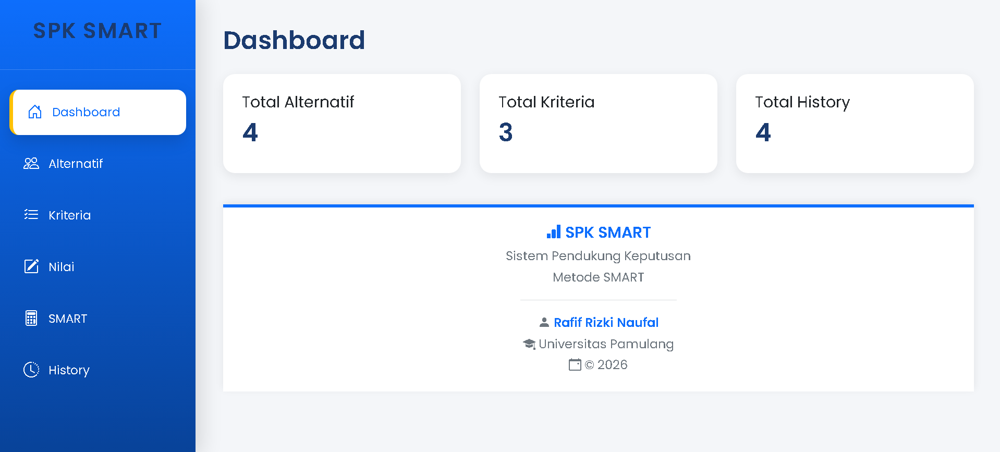
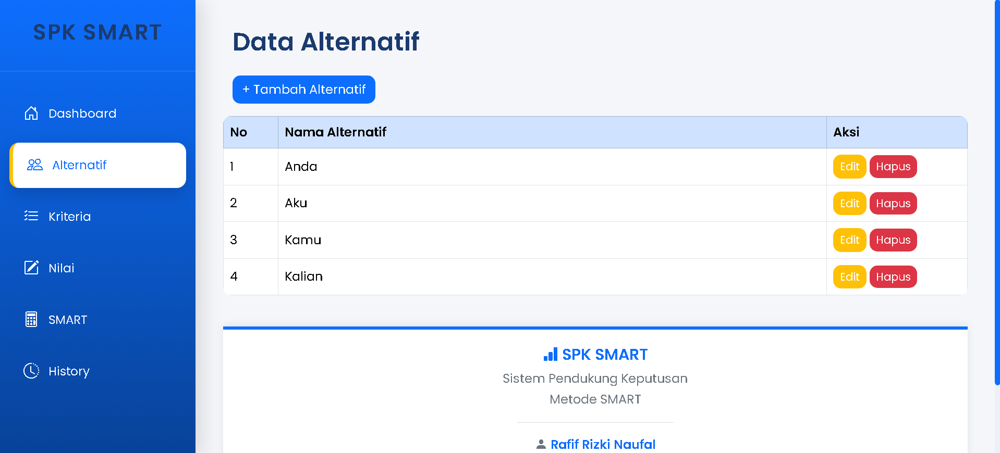
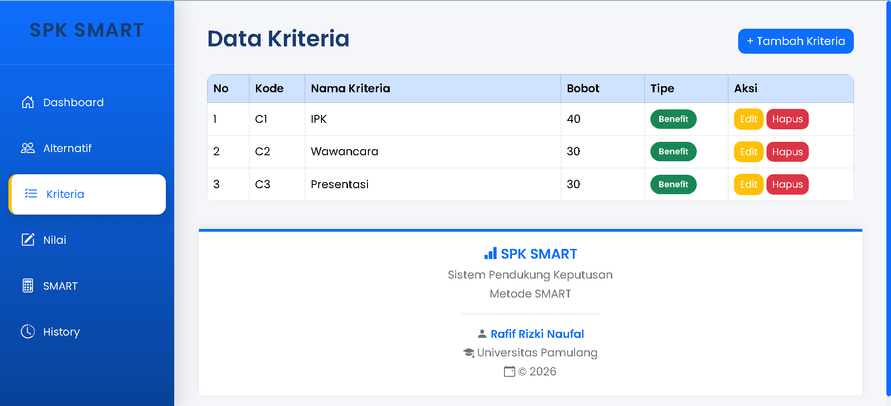
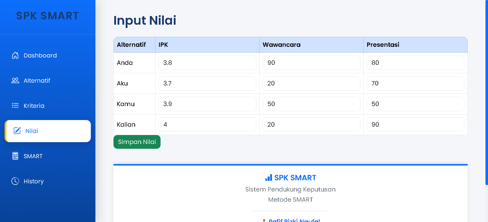
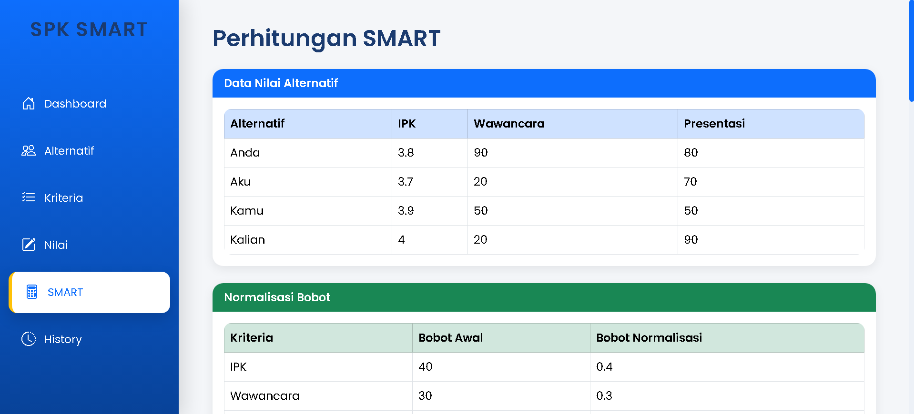
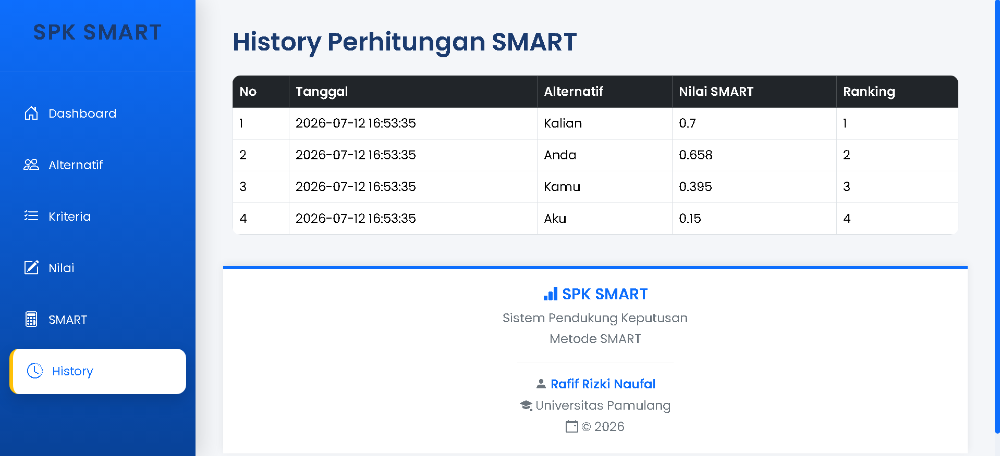

# 🧠 SMART SPK - Decision Support System

A web-based Decision Support System (DSS) implementing the SMART (Simple Multi Attribute Rating Technique) method to assist decision-making based on multiple criteria.

---

## ✨ Features

- 📊 Dashboard
- 📋 Alternative Management
- 📌 Criteria Management
- 📈 Alternative Scoring
- 🧮 SMART Calculation
- 📝 Decision History

---

## 🛠️ Technologies

- PHP Native
- MySQL
- HTML5
- CSS3
- JavaScript

---

## 📂 Project Structure

```text
dashboard/
alternatif/
kriteria/
nilai/
smart/
history/
config/
templates/
assets/
```

---

## 🚀 Installation

1. Clone repository

2. Import database

```
smart_spk.sql
```

3. Run Apache & MySQL

4. Open

```
http://localhost/smart_spk
```

---

## 📸 Screenshots
## Dashboard



## Alternatif



## Kriteria



## Nilai



## SMART Calculation



## Decision Result



---

## 👨‍💻 Author

Rafif Rizki Naufal
